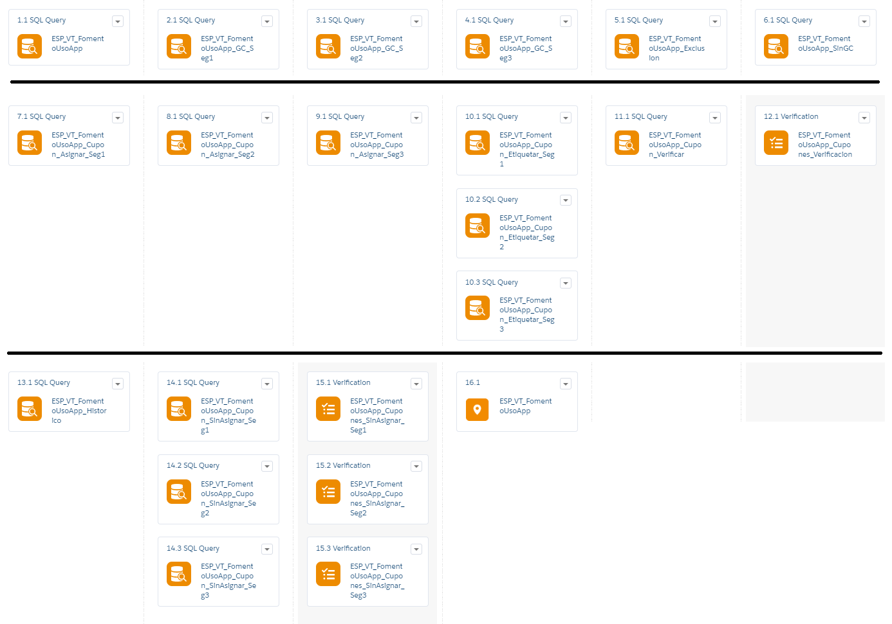
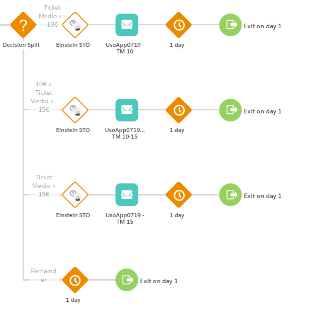
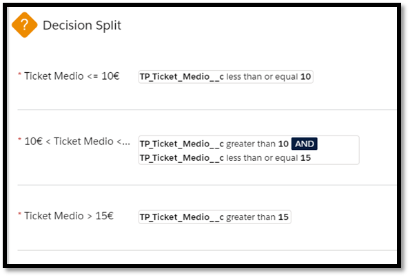

=========================
Journey “Fomento Uso App”
=========================

.. centered:: |image0|

==================== =================================
Date: 19 August 2019 Responsible area: Technology Area
==================== =================================

`1.INTRODUCTION 2 <#introduction>`__

`2. DEVELOPMENT 2 <#development>`__

`2.1 Data Extension 2 <#data-extension>`__

`2.2 Automation 2 <#automation>`__

`2.3 Journey 7 <#journey>`__

1.INTRODUCTION 
===============

This document describes the development process followed for the generation of the Journey "Fomento Uso App".

This process has been structured in 3 steps:

-  Creating Data Extensions.

-  Creating Automation.

-  Creating Journey Builder.

In addition, the target audience has been divided into 3 segments:

-  Segment 1: Average Ticket <= 10€

-  Segment 2: 10€ < Average Ticket <= 15€

-  Segment 3: Average Ticket > 15€

2. DEVELOPMENT
==============

Data Extension
--------------

   Data Extensions have been created to store customers according to some criteria.

   The Data Extensions created for the process are in the next path “Data Extensions > Journeys > Fomento Uso App” and are below:

-  ESP_VT_FomentoUsoApp_SinGC: Data Extension used to send the communication.

-  ESP_VT_FomentoUsoApp_Historico: Stores the records that run in the process with the process date.

-  ESP_VT_FomentoUsoApp_GC: Data Extension with the records that not run in the process. Is used to measure the impact on customers who receive the communication.

-  ESP_VT_FomentoUsoApp_Cupones_Verificacion: Data Extension auxiliar.

-  ESP_VT_FomentoUsoApp_Cupones_SinAsignar_Seg3: Data Extension auxiliar.

-  ESP_VT_FomentoUsoApp_Cupones_SinAsignar_Seg2: Data Extension auxiliar.

-  ESP_VT_FomentoUsoApp_Cupones_SinAsignar_Seg1: Data Extension auxiliar:

-  ESP_VT_FomentoUsoApp_Cupones_Seg3: Stores the coupons.

-  ESP_VT_FomentoUsoApp_Cupones_Seg2: Stores the coupons.

-  ESP_VT_FomentoUsoApp_Cupones_Seg1: Stores the coupons.

-  ESP_VT_FomentoUsoApp: Data Extension with the target audience.

   2. .. rubric:: Automation
         :name: automation

..

   An Automation has been created that during its execution fills Data Extensions with the target audience, assigns coupons to customers and save a history about this process.

|image1|

The Automation is in the next path “my automations > Journey Builder Automations > Fomento Uso App”, with the steps below:

-  STEP 1.1.- **ESP_VT_FomentoUsoApp**: Select the target audience of this Journey.

   -  Type of activity: SQL Query

   -  Target Data Extension: ESP_VT_FomentoUsoApp

   -  Data action: Overwrite

   -  Query:

.. literalinclude:: code/Code_FomentoUsoApp.txt
   :language: guess
   :lines: 1-25
   :linenos:

-  STEP 2.1.- **ESP_VT_FomentoUsoApp_GC_Seg1**: Generates a customers group which don´t receive the communication. This group Will be 10 percent over the total customers in segment 1.

   -  Type of activity: SQL Query

   -  Target Data Extension: ESP_VT_FomentoUsoApp_GC

   -  Data action: Overwrite

   -  Query:

.. literalinclude:: code/Code_FomentoUsoApp.txt
   :language: guess
   :lines: 29-32
   :linenos:

The steps STEP 3.1 and STEP 4.1 are developmed similary to STEP 2.1, but with their respective segments and being the action on the Data Extension type “Append”.

-  STEP 5.1.- **ESP_VT_FomentoUsoApp_Exclusion**: Change the value oh the “GrupoControl” field to identify the customers who belong to this group.

   -  Type of activity: SQL Query

   -  Target Data Extension: ESP_VT_FomentoUsoApp

   -  Data action: Update

   -  Query:

.. literalinclude:: code/Code_FomentoUsoApp.txt
   :language: guess
   :lines: 36-38
   :linenos:

-  STEP 6.1.- **ESP_VT_FomentoUsoApp_SinGC**: Generates the customers group which will receive the communication.

   -  Type of activity: SQL Query

   -  Target Data Extension: ESP_VT_FomentoUsoApp_SinGC

   -  Data action: Overwrite

   -  Query:

.. literalinclude:: code/Code_FomentoUsoApp.txt
   :language: guess
   :lines: 42-44
   :linenos:

-  STEP 7.1.- **ESP_VT_FomentoUsoApp_Cupon_Asignar_Seg1**: Adds the offer to segment 1 customers who will receive the communication.

   -  Type of activity: SQL Query

   -  Target Data Extension: ESP_VT_FomentoUsoApp_SinGC

   -  Data action: Update

   -  Query:

.. literalinclude:: code/Code_FomentoUsoApp.txt
   :language: guess
   :lines: 48-61
   :linenos:

The steps STEP 8.1 and STEP 9.1 are developmed similary to STEP 7.1, but with their respective segments.

-  STEP 10.1.- **ESP_VT_FomentoUsoApp_Cupon_Etiquetar_Seg1**: Changes the coupon like “Assigned” and add the assignment date.

   -  Type of activity: SQL Query

   -  Target Data Extension: ESP_VT_FomentoUsoApp_Cupones_Seg1

   -  Data action: Update

   -  Query:

.. literalinclude:: code/Code_FomentoUsoApp.txt
   :language: guess
   :lines: 65-67
   :linenos:

The steps STEP 10.2 and STEP 10.3 are developmed similary to STEP 10.1, but with their respective segments.

-  STEP 11.1.- **ESP_VT_FomentoUsoApp_Cupon_Verificar**: Generates a customers group that has the field corresponding to coupon like null.

   -  Type of activity: SQL Query

   -  Target Data Extension: ESP_VT_FomentoUsoApp_Cupones_Verificacion

   -  Data action: Overwrite

   -  Query:

.. literalinclude:: code/Code_FomentoUsoApp.txt
   :language: guess
   :lines: 71-73
   :linenos:

-  STEP 12.1.- **ESP_VT_FomentoUsoApp_Cupon_Verificar**: Counts how many customers will receive the communication and don´t have an offer. The count have to be zero, because if there are any customers the process stops and send email notification to warn about the situation.

   -  Type of activity: Verification

   -  Target Data Extension: ESP_VT_FomentoUsoApp_Cupones_Verificacion

   -  Rules: *If count is not equal to 0*

-  STEP 13.1.- **ESP_VT_FomentoUsoApp_Historico**: Saves customers who have been in the process, even when they don´t receive a communication, and add to those customers the process date.

   -  Type of activity: SQL Query

   -  Target Data Extension: ESP_VT_FomentoUsoApp_Historico

   -  Data action: Update

   -  Query:

.. literalinclude:: code/Code_FomentoUsoApp.txt
   :language: guess
   :lines: 77-78
   :linenos:

-  STEP 14.1.- **ESP_VT_FomentoUsoApp_Cupon_SinAsignar_Seg1**: Generates a coupon group of segment 1 that have the field corresponding to assignment as false.

   -  Type of activity: SQL Query

   -  Target Data Extension: ESP_VT_FomentoUsoApp_Cupones_SinAsignar_Seg1

   -  Data action: Overwrite

   -  Query:

.. literalinclude:: code/Code_FomentoUsoApp.txt
   :language: guess
   :lines: 82-84
   :linenos:

The steps STEP 14.2 and STEP 14.3 are developmed similary to STEP 14.1, but with their respective segments.

-  STEP 15.1.- **ESP_VT_FomentoUsoApp_Cupones_SinAsignar_Seg1**: Counts how many coupons are without assignment. When this count is less than a specific value an email is send for insert more coupons in the corresponding Data Extension.

   -  Type of activity: Verification

   -  Target Data Extension: ESP_VT_FomentoUsoApp_Cupones_SinAsignar_Seg1

   -  Rules: *If count is less than 4.000*

The steps STEP 15.2 and STEP 15.3 are developmed similary to STEP 15.1, but with their respective segments.

-  STEP 16.1.- **JB_VT_CA_FomentoUsoApp**: This step is automatically generated when the journey is activated from the Journey Builder tool.

   3. .. rubric:: Journey
         :name: journey

An Journey has been created to manage the sending of emails. This tool applies the Salesforce intelligence artificial called Einstein and assigns the creative to email.

The Journey generated is below:

|image2|

The settings applied are below:

-  Filter Criteria: CambiaSegmento = false

-  Exit Criteria: CambioSegmento = true

-  Data Extension: ESP_VT_FomentoUsoApp_SinGC

-  Activities:

   -  Decision Split

   |image3|

	-  Einstein STO

	-  Email: Templates “UsoApp0719 - TM 10”, ” UsoApp0719 … TM 10-15”, “UsoApp0719 - TM 15”

	-  Wait By Duration: 1days

.. |image0| image:: media/image1.png
   :width: 3.73333in
   :height: 4.15357in

