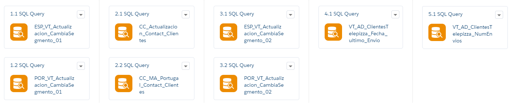

============
Daily Update
============

.. centered:: |image0|

======================= =================================
Date: 05 September 2019 Responsible area: Technology Area
======================= =================================

`1.INTRODUCTION 1 <#introduction>`__

`2. DEVELOPMENT 1 <#development>`__

`2.1 Generate the Data Extensions 1 <#generate-the-data-extensions>`__

`2.2 Generate the Automation 2 <#generate-the-automation>`__

1.INTRODUCTION 
===============

This document describes the development process followed for updating customer information in Salesforce Marketing Cloud.

Customer data in Marketing Cloud is updated from Service Cloud.

2. DEVELOPMENT
==============

The development process has been divided into two parts:

Generate the Data Extensions
----------------------------

   Data Extensions have been created to store the information necessary for the correct development of the process.

   The Data Extensions created for the process are below:

-  **ClientesTelepizza**: This Data Extension will be used as a master data table for the country Spain.

-  **ESP_VT_ActualizacionDiaria_CambiaSegmento**: Auxiliary Data Extension.

-  **Portugal_ClientesTelepizza**: This Data Extension will be used as a master data table for the country Portugal in Marketing Cloud.

-  **POR_VT_ActualizacionDiaria_CambiaSegmento**: Auxiliary Data Extension.

   2. .. rubric:: Generate the Automation
         :name: generate-the-automation

   An Automation has been created that during its execution overwrite and update the “ClientesTelepizza” and “Portugal_ClientesTelepizza” Data Extensions with the Salesforce Service Cloud information, then creates a file for each of those Data Extensions and store in FTP Marketing Cloud.

|image1|

The Data Extensions “ClientesTelepizza” and “Portugal_ClientesTelepizza” are overwritten, so to not lose the information in those Data Extensions there are some auxiliary steps.

-  The first step creates a copy of the Data Extensions “ClientesTelepizza” and “Portugal_ClientesTelepizza”, because the field “CambiaSegmento” is important for the correct work of the journey process and there isn´t this field in Service Cloud, so when the overwrite process is done the value of this field is lost. The copies are store in the “ESP_VT_ActualizacionDiaria_CambiaSegmento” and “POR_VT_ActualizacionDiaria_CambiaSegmento” Data Extensions.

-  In the second step the Data Extensions are overwritten the Data Extensions “ClientesTelepizza” and “Portugal_ClientesTelepizza”.

-  The third step updates the “CambiaSegmento” field in the Data Extensions “ClientesTelepizza” and “Portugal_ClientesTelepizza” with the value stored in “ESP_VT_ActualizacionDiaria_CambiaSegmento” and “POR_VT_ActualizacionDiaria_CambiaSegmento”.

-  The fourth step updates the “Fecha_Ultimo_Envio” field in the Data Extension “ClientesTelepizza” with the value stored in the DataView “_Sent”.

-  The fifth step updates the “Num_Envios_90d” field in the Data Extension “ClientesTelepizza” with the value calculated with the DataView “_Sent”.

.. |image0| image:: media/image1.png
   :width: 2.73333in
   :height: 3.15357in

