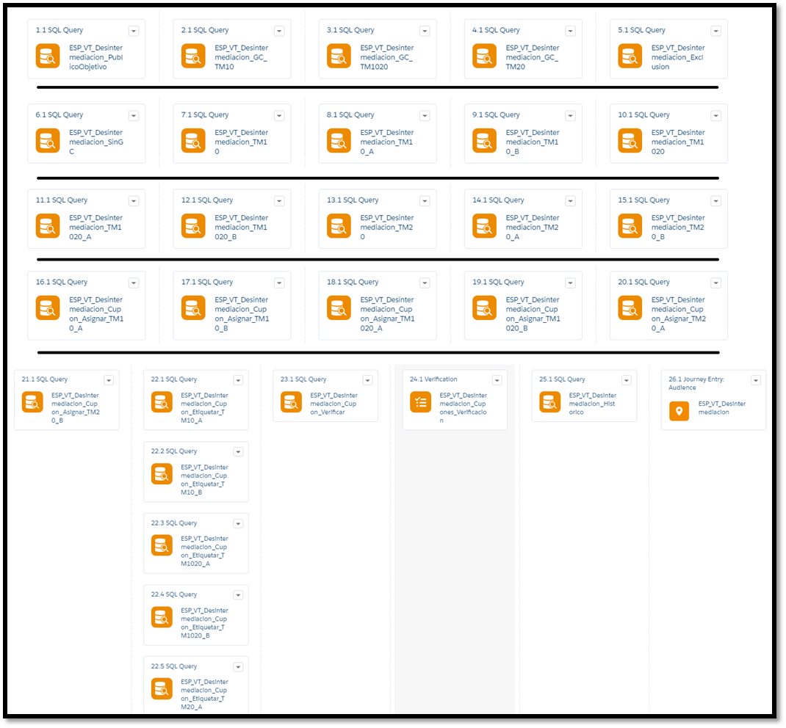
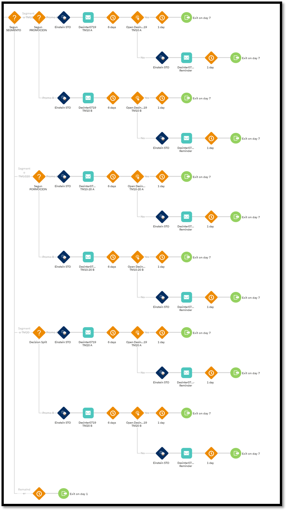
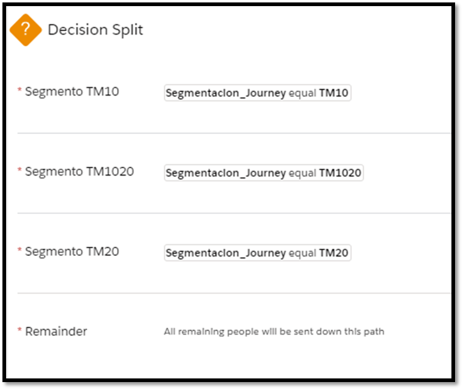
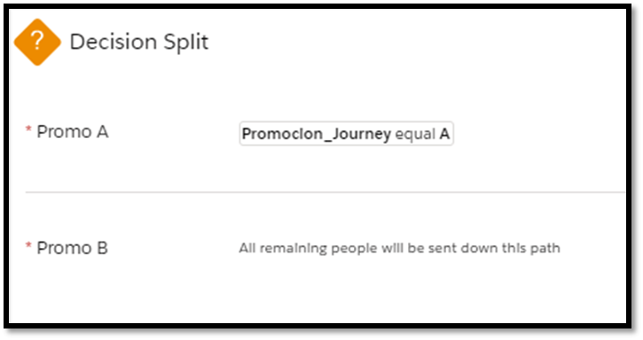

===========================
Journey “Desintermediacion”
===========================

.. centered:: |image0|

======================= =================================
Date: 19 September 2019 Responsible area: Technology Area
======================= =================================

`1.INTRODUCTION 2 <#introduction>`__

`2. DEVELOPMENT 2 <#development>`__

`2.1 Data Extension 2 <#data-extension>`__

`2.2 Automation 2 <#automation>`__

`2.3 Journey 7 <#journey>`__

1.INTRODUCTION 
===============

This document describes the development process followed for the generation of the Journey "Desintermediacion".

This process has been structured in 3 steps:

-  Creating Data Extensions.

-  Creating Automation.

-  Creating Journey Builder.

In addition, the target audience has been divided into 3 segments:

-  Segment 1: Average Ticket <= 10€

-  Segment 2: 10€ < Average Ticket <= 20€

-  Segment 3: Average Ticket > 20€

And besides, each segments has been divided into 2 promotions:

-  Promotion A.

-  Promotion B.

2. DEVELOPMENT
==============

Data Extension
--------------

   Data Extensions have been created to store customers according to some criteria.

   The Data Extensions created for the process are in the next path “Data Extensions > Journeys > Desintermediación” and are below:

-  ESP_VT_Desintermediacion_SinGC: Data Extension used to send the communication.

-  ESP_VT_Desintermediacion_Historico: Stores the records that run in the process with the process date.

-  ESP_VT_Desintermediacion_GC: Data Extension with the records that not run in the process. Is used to measure the impact on customers who receive the communication.

-  ESP_VT_Desintermediacion_Cupones_Verificacion: Data Extension auxiliar.

-  ESP_VT_Desintermediacion_Cupones_Seg3: Stores the coupons.

-  ESP_VT_Desintermediacion_Cupones_Seg2: Stores the coupons.

-  ESP_VT_Desintermediacion_Cupones_Seg1: Stores the coupons.

-  ESP_VT_Desintermediacion: Data Extension with the target audience.

   2. .. rubric:: Automation
         :name: automation

An Automation has been created that during its execution fills Data Extensions with the target audience, assigns coupons to customers and save a history about this process.

|image1|

The Automation is in the next path “my automations > Journey Builder Automations > Desintermediación > ESP_VT_Desintermediacion”, with the steps below:

-  STEP 1.1.- **ESP_VT_Desintermediacion_PublicoObjetivo**: Select the target audience of this Journey.

   -  Type of activity: SQL Query

   -  Target Data Extension: ESP_VT_Desintermediacion

   -  Data action: Overwrite

   -  Query:

.. literalinclude:: code/Code_Desintermediacion.txt
   :language: guess
   :lines: 1-11
   :linenos:

-  STEP 2.1.- **ESP_VT_Desintermediacion_GC_TM10**: Generates a customers group which don´t receive the communication. This group Will be 10 percent over the total customers in segment TM10.

   -  Type of activity: SQL Query

   -  Target Data Extension: ESP_VT_Desintermediacion_GC

   -  Data action: Overwrite

   -  Query:

.. literalinclude:: code/Code_Desintermediacion.txt
   :language: guess
   :lines: 15-18
   :linenos:

The steps STEP 3.1 and STEP 4.1 are developmed similary to STEP 2.1, but with their respective segments and being the action on the Data Extension type “Append”.

-  STEP 5.1.- **ESP_VT_Desintermediacion_Exclusion**: Change the value oh the “GrupoControl” field to identify the customers who belong to this group.

   -  Type of activity: SQL Query

   -  Target Data Extension: ESP_VT_Desintermediacion

   -  Data action: Update

   -  Query:

.. literalinclude:: code/Code_Desintermediacion.txt
   :language: guess
   :lines: 22-24
   :linenos:

-  STEP 6.1.- **ESP_VT_Desintermediacion_SinGC**: Generates the customers group which will receive the communication.

   -  Type of activity: SQL Query

   -  Target Data Extension: ESP_VT_Desintermediacion_SinGC

   -  Data action: Overwrite

   -  Query:

.. literalinclude:: code/Code_Desintermediacion.txt
   :language: guess
   :lines: 28-30
   :linenos:

-  STEP 7.1.- **ESP_VT_Desintermediacion_TM10**: Changes the value oh the “Segmentacion_Journey” field to identify the customer´s segment.

   -  Type of activity: SQL Query

   -  Target Data Extension: ESP_VT_Desintermediacion_SinGC

   -  Data action: Update

   -  Query:

.. literalinclude:: code/Code_Desintermediacion.txt
   :language: guess
   :lines: 34-36
   :linenos:

The steps STEP 10.1 and STEP 13.1 are developmed similary to STEP 7.1, but with their respective segments.

-  STEP 8.1.- **ESP_VT_Desintermediacion_TM10_A**: Changes the value oh the “Promocion_Journey” field to identify the customer´s promotion in each segment.

   -  Type of activity: SQL Query

   -  Target Data Extension: ESP_VT_Desintermediacion_SinGC

   -  Data action: Update

   -  Query:

.. literalinclude:: code/Code_Desintermediacion.txt
   :language: guess
   :lines: 40-43
   :linenos:

The steps STEP 8.1, STEP 11.1 and STEP 14.1 assign to promotion A and STEP 9.1, STEP 12.1 and STEP 15.1 assign to promotion B.

-  STEP 16.1.- **ESP_VT_Desintermediacion_Cupon_Asignar_TM10_A**: Adds the TM10 segment offer with promotion A to customers who will receive this type of communication.

   -  Type of activity: SQL Query

   -  Target Data Extension: ESP_VT_Desintermediacion_SinGC

   -  Data action: Update

   -  Query:

.. literalinclude:: code/Code_Desintermediacion.txt
   :language: guess
   :lines: 47-60
   :linenos:

The steps STEP 17.1, STEP 18.1, STEP 19.1, STEP 20.1 and STEP 21.1 are developmed similary to STEP 16.1, but with their respective segments and promotions.

-  STEP 22.1.- **ESP_VT_Desintermediacion_Cupon_Etiquetar_TM10_A**: Changes the coupon like “Assigned” and add the assignment date.

   -  Type of activity: SQL Query

   -  Target Data Extension: ESP_VT_Desintermediacion_Cupones_TM10_A

   -  Data action: Update

   -  Query:
   

.. literalinclude:: code/Code_Desintermediacion.txt
   :language: guess
   :lines: 64-66
   :linenos:

The steps STEP 22.2, STEP 22.3, STEP 22.4, STEP 22.5 and STEP 22.6 are developmed similary to STEP 22.6, but with their respective coupon´s Data Extension.

-  STEP 23.1.- **ESP_VT_Desintermediacion_Cupon_Verificar**: Generates a customers group that has the field corresponding to coupon like null.

   -  Type of activity: SQL Query

   -  Target Data Extension: ESP_VT_Desintermediacion_Cupones_Verificacion

   -  Data action: Overwrite

   -  Query:

.. literalinclude:: code/Code_Desintermediacion.txt
   :language: guess
   :lines: 70-72
   :linenos:

-  STEP 24.1.- **ESP_VT_Desintermediacion_Cuponones_Verificar**: Counts how many customers will receive the communication and don´t have an offer. The count have to be zero, because if there are any customers the process stops and send email notification to warn about the situation.

   -  Type of activity: Verification

   -  Target Data Extension: ESP_VT_Desintermediacion_Cupones_Verificacion

   -  Rules: *If count is not equal to 0*

-  STEP 25.1.- **ESP_VT_Desintermediacion_Historico**: Saves customers who have been in the process, even when they don´t receive a communication, and add to those customers the process date.

   -  Type of activity: SQL Query

   -  Target Data Extension: ESP_VT_Desintermediacion_Historico

   -  Data action: Update

   -  Query:

.. literalinclude:: code/Code_Desintermediacion.txt
   :language: guess
   :lines: 76-77
   :linenos:

-  STEP 26.1.- **ESP_VT_Desintermediacion**: This step is automatically generated when the journey is activated from the Journey Builder tool.

   3. .. rubric:: Journey
         :name: journey

An Journey has been created to manage the sending of emails. This tool applies the Salesforce intelligence artificial called Einstein and assigns the creative to email depending on the segments and promotions.

The Journey generated is below:

|image2|

The settings applied are below:

-  Filter Criteria: CambiaSegmento = false

-  Exit Criteria: CambioSegmento = true OR Fecha_de_ultimo_pedido__c is after Today Minus 6 days

-  Data Extension: ESP_VT_Desintermediacion_SinGC

-  Activities:

   -  Decision Split for segments:

|image3|

   -  Decision Split for promotions:

|image4|

   -  Einstein STO

   -  Email: Templates “Desinter0719 TM10 A”, “Desinter0719 TM10 A Reminder”, “Desinter0719 TM10 B”, “Desinter0719 TM10 B Reminder”, “Desinter0719 TM10-20 A”, “Desinter0719 TM10-20 A Reminder”, “Desinter0719 TM10-20 B”, “Desinter0719 TM10-20 B Reminder”, “Desinter0719 TM20 A”, “Desinter0719 TM20 A Reminder”, “Desinter0719 TM20 B” and “Desinter0719 TM20 B Reminder”.

   -  Wait By Duration: 6 days and 1 day.

   -  Engagement Split: Message Metrics “Opens”.

.. |image0| image:: media/image1.png
   :width: 2.73333in
   :height: 3.15357in

