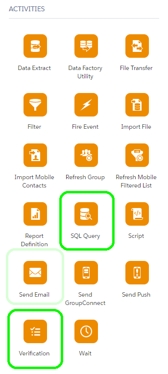
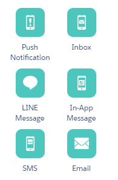
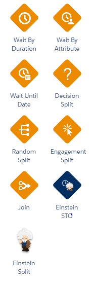

.. centered:: |image0|

===============
Marketing Cloud
===============

1. Introducción 
================

1.1 Propósito 
--------------

El presente documento recopila el análisis funcional del entorno de Salesforce Marketing Cloud.

1.2 Usuarios 
-------------

Equipo de desarrollo de Vector ITC Group.

1.3 Alcance
-----------

El presente documento constituye un análisis funcional para la implementación y desarrollo de los casos de usos en Salesforce Marketing Cloud.

1.4 Resumen 
------------

La estructura considerada para gestionar la organización multi-país dentro del entorno de Marketing Cloud ha sido generar una *Business Unit* por país.

En cada una de las *Business Unit* generadas se desarrollarán los procesos para los envíos de comunicaciones considerados para cada país, así como la base de datos de clientes específicos de ese país (exceptuando la *Business Unit* de España, dentro de la cual estarán todos los clientes).

Los datos de los clientes (los cuales definen si reciben una comunicación) se actualizan diariamente desde Salesforce Service Cloud en aquellos clientes definidos como contactables.

1.5 Advertencias
----------------

Actualmente existen una serie de consideraciones sobre el entorno de Salesforce Marketing Cloud a tener en cuenta:

-  Salesforce Marketing Cloud no tiene entorno de Desarrollo, Preproducción, ... solo dispone de entorno de Producción.

-  Actualmente los datos existentes en Marketing Cloud son creados y actualizados en función de los datos existentes en el entorno de Salesforce Service Cloud.

-  Cuando se realiza algún cambio en un proceso activo desde la herramienta *Automation Studio,* el proceso se detiene automáticamente y se debe activar nuevamente de forma manual.

1.6 Glosario, acrónimos y definiciones
--------------------------------------

-  **Automation:** Proceso ejecutado en la herramienta Automation Studio utilizado principalmente para la carga de datos necesarios en las Data Extensions correspondientes.

-  **Automation Studio**: Herramienta que permite la creación de programas de marketing en varios pasos donde en función de diferentes eventos se desencadenan acciones.

-  **Business Unit**: Estructura de administración que controla el acceso a la información y el intercambio de información. También permite administrar roles y permisos de usuarios, o definir filtros para suscriptores.

-  **Content Builder:** Herramienta de administración de contenido multicanal que le permite consolidar imágenes, documentos y contenido en una única ubicación para usar en Marketing Cloud.

-  **Cliente Contactable o Subscribers:** Clientes que han aceptado el envío de comunicaciones.

-  **Data Extension**: Tablas de datos que contienen atributos y valores, principalmente de los clientes.

-  **Data View:** Tablas de datos propias de Marketing Cloud que almacenan datos de seguimiento. Solo pueden ser consultadas, pero no creadas o modificadas.

-  **Email:** Tipo de mensaje electrónico con contenido (textos, imágenes, ...) que se envía a la bandeja de entrada de correo electrónico de los suscriptores.

-  **Email Studio**: Herramienta que permite crear, dirigir, entregar, realizar seguimientos y administrar programas de marketing por correo electrónico.

-  **Journey:** Proceso ejecutado en la herramienta Journey Builder utilizado principalmente para el envío de las comunicaciones.

-  **Journey Builder:** Herramienta que automatiza actividades de marketing, como el control de los flujos de mensajes en función de programaciones o comportamientos.

-  **Subscriber Key**: Es una clave tipo texto que identifica de forma única a un suscriptor en Marketing Cloud.

-  **Template:** Plantilla que define el encabezado, color de fondo, bordes y diseño de un correo electrónico.

-  **Unsubscriber:** Estado de Marketing Cloud que significa la cancelación de comunicaciones.

2. Vista general del proyecto 
==============================

2.1 Propósito, alcance y objetivos
----------------------------------

El entorno de Salesforce Marketing Cloud es empleado dentro del proyecto de transformación digital de Telepizza para el envío de comunicaciones a clientes.

Los envíos de comunicaciones se realizan mediante procesos denominados *journey*, los cuales se corresponden con casos de usos desarrollados en Salesforce Marketing Cloud.

2.2 Aclaraciones previas 
-------------------------

En general en Marketing Cloud se denominan a los procesos con el mismo nombre que el de la herramienta utilizada para su desarrollo, es decir, nos referimos como *Automation* al proceso generado con la herramienta Automation Studio.

Para el caso de “Journey”, se emplea *Journey* para referirnos al proceso generado con la herramienta Journey Builder, y Journey para los distintos casos de uso a implementar en Marketing Cloud.

3. Resumen de procesos del sistema 
===================================

3.1 Actores y casos de uso. Modelos básicos 
--------------------------------------------

Para cada país se han desarrollado casos de usos específicos. Los casos de uso de cada país son los siguientes:

3.1.1 España
~~~~~~~~~~~~

-  Journey Cambio de Segmento

-  Journey Primera Compra

-  Journey Segunda Compra

-  Journey Reactivación

-  Journey Fomento Uso App

-  Journey Cumpleaños

-  Journey Aniversario

-  Journey Desintermediacion

-  Journey Verano

3.1.2 Portugal
~~~~~~~~~~~~~~

-  Journey Cambio de Segmento

-  Journey Primera Compra

-  Journey Segunda Compra

El modelo básico se ha desarrollado en 3 procesos:

*Data Extension -> Automation -> Journey*

Sin embargo en algunos casos puntuales (como en los Journey Aniversario o Cumpleaños) no ha sido necesario desarrollar el proceso de *Journey* y el envío se ha realizado en el proceso *Automation*.

3.2 Procesos 
-------------

-  Procesos principales

..

   **Data Extension**

   Se generan las Data Extension necesarias para el correcto envío de comunicaciones.

   De forma general, existen una serie de Data Extension mínimas para el funcionamiento en los *journeys* generados:

-  Data Extension del público objetivo: Consulta la base de datos actualizada de una Business Unit, y almacena los clientes que cumplen los criterios de selección para recibir la comunicación.

-  Data Extension de cupones: Almacena las ofertas que se asociaran a la comunicación.

..

   **Automation**

   El proceso *Automation* se ejecuta en pasos o steps. En cada paso se asignan actividades.

   Principalmente se han utilizado las actividades SQL Query y Verification.

.. centered:: |image1|

-  SQL Query: Esta actividad ejecuta una consulta mediante query sobre la Data Extension objetivo y una acción tras haber realizado la consulta. La acción es sobre una Data Extension a seleccionar (no es Data Extension objetivo) y permite añadir, añadir si no existe o actualizar si existe, o sobrescribir sobre la Data Extension seleccionada.

-  Verification: Esta actividad ejecuta una consulta sobre el número de registros existentes en una Data Extension y se permite imponer acciones en función de ese número. Las acciones son parada del proceso *Automation* y envío de alertas vía email.

..

   El proceso *Automation* se inicializa mediante programación horaria.

   **Journey**

   El proceso *Journey* se ejecuta en función de flujos que recorren los clientes durante el proceso del envío de las comunicaciones. Según el flujo puede variar la creatividad asignada, los clientes que reciben próximas comunicaciones, ...

   La entrada de datos al proceso se realiza mediante consulta a una Data Extension objetivo o consulta a un registro de Salesforce Service Cloud.

   Durante todo el proceso *Journey* se pueden imponer condiciones de exclusión (para clientes que no recibirán la comunicación), tanto al inicializar el proceso como durante su ejecución. Dichas condiciones se elaboran mediante la consulta de datos actualizados de los clientes.

   La configuración de los flujos en el proceso *Journey* se desarrolla mediante actividades, las cuales se subdividen en grupos conforme a su funcionalidad:

-  Definen el canal utilizado para el envío de la comunicación (por ejemplo email, sms, notificación push, ...), añaden la creatividad a la comunicación y realizan su envío.

.. centered:: |image2|

-  Controlan el flujo que realizan los clientes imponiendo condiciones o Inteligencia Artificial.

.. centered:: |image3|

-  Modifica los datos de un registro en Marketing Cloud.

.. centered:: |image4|

-  Procesos auxiliares

..

   **Data Extension**

   De manera complementaria se generan una seria de Data Extension que aumentan el control sobre el proceso y facilitan su administración:

-  Data Extension del grupo de control: Almacena un 10% del público objetivo. Los clientes del grupo de control no recibirán la comunicación y serán utilizados para medir el impacto de esta.

-  Data Extension del histórico del *journey*: Almacena los clientes que han realizado completamente el proceso *Automation.*

-  Data Extension de verificación de cupones: Se generan dos Data Extensions para el control de cupones. La primera almacena los clientes una vez se les ha asignado una oferta, se comprueba la asignación, y si existe un cliente sin oferta asignada se detiene el proceso *Automation* y se envían alertas vía email. El segundo almacena los cupones que permanecen en la Data Extension de cupones sin utilizar; y si el número de cupones es inferior a un número X se envían alertas vía email, siendo X una aproximación del mínimo de cupones necesarios para que aún se ejecute tres veces más el proceso *Automation* y no existan clientes sin ofertas\ *.*

..

   **Journey**

   De manera alternativa a la ejecución de un proceso *Journey* para el envío de una comunicación, se puede utilizar la actividad Send Email.

   Send email: Esta actividad asigna una creatividad a la comunicación y realiza el envío de esta a todos los clientes existentes en la Data Extension seleccionada.

.. |image0| image:: media/image1.png
   :width: 2.73333in
   :height: 3.15357in

