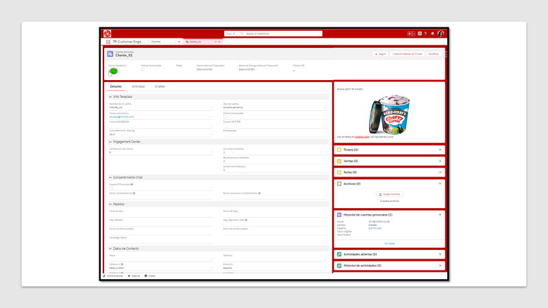

.. centered:: |image0|

=============
Service Cloud
=============

Introducción 
=============

Propósito 
----------

El presente documento recopila el análisis funcional del entorno de Salesforce Service Cloud.

Usuarios 
---------

Equipo de desarrollo de Vector ITC Group.

Alcance
-------

El presente documento constituye un análisis funcional para el desarrollo de la plataforma Salesforce Service Cloud como CRM y como Contact Center.

Resumen 
--------

   Salesforce Service Cloud es una plataforma de servicio y soporte de atención al cliente en tiempo real empleada para ayudar a obtener una resolución de casos rápida y confiable, ya que permite unificar en una sola plataforma todos los canales digitales de comunicación de atención al cliente.

   Asimismo, la plataforma Salesforce Service Cloud será empleada como CRM ya que posibilita el almacenamiento y tratamiento de datos, produciéndose la actualización de estos datos a través de procesos ETLs, siendo el origen de datos el Data Warehouse. En algunos casos se realizarán actualizaciones de los datos en tiempo real, como serían los correspondientes al “carrito abandonado”.

Advertencias
------------

Actualmente existen una serie de consideraciones sobre el entorno de Salesforce Service Cloud a tener en cuenta:

	
.. warning::

	-  Si existe algún proceso activo de carga de datos en Salesforce Service Cloud pueden verse afectados algunos servicios del Contact Center.

	-  Los procesos de carga de datos (los procesos de cargas diarias, no mensuales) en Service Cloud deben ejecutarse y finalizar antes del proceso de actualización diaria de Marketing Cloud, ya que existen ejecuciones automáticas en Marketing Cloud cuyo correcto funcionamiento depende de la actualización de dichos datos.

Glosario, acrónimos y definiciones
----------------------------------

-  **Casos:** Objeto que representa los tickets en el entorno de Salesforce.

-  **Centro de Mensajes:** Cuadro de noticias e información que estará presente en la interfaz del Contact-Center.

-  **Chatter**: Herramienta de colaboración en tiempo real de Salesforce que permite a los usuarios comunicarse y compartir información.

-  **Cuentas**: Objeto que representa a los clientes y las tiendas en el entorno de Salesforce.

-  **Macro**: Herramienta que facilita la respuesta a cliente mediante la selección de plantillas de email preconfiguradas en función del tipo de ticket a contestar.

-  **Omni-Channel**: Herramienta que permite al Agente proporcionar servicio al cliente, directamente desde la consola de Salesforce y en tiempo real.

-  **Ticket: \______________________________________________\_**

-  **Vistas de lista: L**\ istado de registros que cumplen unos criterios de filtro. Los registros pueden ser clientes, tiendas, tickets, informes, paneles, tareas, eventos, valoraciones, …

Vista general del proyecto 
===========================

Propósito, alcance y objetivos
------------------------------

El entorno de Salesforce Service Cloud es empleado dentro del proyecto de transformación digital de Telepizza para administrar y proveer de soporte y asistencia al consumidor según los productos, servicios o información solicitada.

Para ello se desarrollarán aplicaciones que realizarán la función de Contact Center en todos los canales de comunicación para cada marca y país dentro del Grupo Telepizza.

Los usuarios del Contact Center serán el personal del Grupo Telepizza encargado de resolver los tickets, quienes serán responsables de dar servicio al cliente. A su vez el personal del Contact Center tiene distintos cargos o responsabilidades:

-  **Agentes**: Responsables de dar servicio al cliente a través de cualquiera de los canales del Contact Center. Por lo general se discretizarán los agentes por país, ya que un solo agente puede atender tickets de diferentes marcas.

..

   Ejemplo:

.. code-block:: guess

	Un agente de Telepizza en España puede resolver tickets de clientes de Pizza Hut en España.

	Un agente de Telepizza en España no puede resolver tickets de clientes Telepizza en Portugal.

-  **Coordinador**: Son los responsables de organizar el trabajo de los agentes, mediante el control de las acciones realizadas por los agentes en la resolución de los tickets.

-  **Supervisor**: Son responsables del correcto funcionamiento del Contact Center y de la toma de decisiones en situaciones excepcionales.

Aclaraciones previas 
---------------------

Se ha considerado utilizar una única *Org* en el entorno de Salesforce Service Cloud para la gestión de todos los países, desarrollando diferentes aplicaciones dentro de Service Cloud para la gestión multipaís del Grupo Telepizza.

Cada una de las aplicaciones desarrolladas se correspondería con un Contact Center utilizado para gestionar las diferentes marcas en un país en concreto.

Cada Contact Center tiene capacidad para dar servicio en cualquiera de los canales de comunicación existentes, los cuales se han agrupado de la siguiente manera:

-  **Chat**: Se corresponde con los tickets recibidos a través de una conversación de chat con el cliente.

-  **Teléfono**: Se corresponde con los tickets recibidos a través de una llamada por parte del cliente.

-  **Tickets**: Se corresponde con los tickets recibidos a través de cualquiera de los canales escritos, como correo electrónico, web, redes sociales, ...

-  **Todo**: No discretiza entre canales, tiene acceso a todos los tickets recibidos.

..

   También hay que tener en consideración que cada vez que se crea un cliente en Salesforce Service Cloud, debido a la configuración de la solución adoptada, se generan dos objetos asociados a ese cliente, un objeto Cuenta y un objeto Contacto.

Resumen de procesos del sistema 
================================

Actores y casos de uso. Modelos básicos 
----------------------------------------

Las aplicaciones utilizadas como Contact Center se han desarrollado en base a una serie de casos de usos que han permitido tanto la configuración y administración del entorno Salesforce Service Cloud como el despliegue del Contact Center.

Los casos de usos a su vez se han subdividido en 3 grupos:

-  Middle/Back End

-  Front End (Operador)

-  Front End (Supervisor)

..

   Los casos de usos de Middle/Back End están orientados a la configuración y administración de la plataforma Service Cloud, lo cual ha constituido las bases para el desarrollo del Contact Center. Los casos de usos de este grupo son:

-  Carga del catálogo de productos

-  Definición de cliente

-  Modelo de Seguridad

-  Integración pedidos (d-1)

-  Intregración histórico y movimientos Telepicoins

-  Integración con pedidos tiempo real (tracker)

-  Configuración mail-to-case

-  Configuación Entitlement Process

-  Integración cupones (manual)

-  Configuración ficha "Búsqueda Usuario"

-  Configuración Live Agent

-  Configuración Omni-channel

-  Integración Tiendas

-  Configuración knowledge base

-  Configuración macros

-  Integración de las reclamaciones con los sistema de tienda

-  Configuración Social CRM

-  Integración con las encuestas satisfacción pedido online

-  Integración Google Business

-  Integración Google Play

-  Integración Apple Store

-  Generación componente "Búsqueda de tienda"

..

   Los casos de usos de Front End (Operador) están orientados a aumentar las funcionalidades de los operadores del Contact Center. Los casos de usos de este grupo son:

-  Como Operador, cuando recibo una llamada necesito identificar como cliente a la persona que tengo al teléfono

-  Como Operador, cuando recibo un caso vía email necesito identificar como cliente a la persona que lo ha enviado

-  Como Operador, cuando recibo un caso vía redes sociales, necesito identificar como cliente a la persona que lo ha enviado

-  Como Operador, cuando recibo una petición vía chat, necesito identificar como cliente a la persona que lo ha enviado

-  Como Operador, cuando tengo el cliente identificado al teléfono, me indica que quiere hacer una CONSULTA

-  Como Operador, cuando tengo el cliente identificado al teléfono, me indica que quiere saber la TIENDA MÁS CERCANA

-  Como Operador, cuando tengo el cliente identificado al teléfono, me indica que quiere abrir una INCIDENCIA

-  Como Operador, cuando tengo el cliente identificado al teléfono, me indica que quiere abrir una RECLAMACIÓN

-  Como Operador, tengo tipificar los casos que gestiono

-  Como Operador, tengo tipificar los casos que se me asignan automáticamente

-  Como Operador, tengo que asignarme los casos para poder resolverlos

-  Como Operador, tengo que resolver un caso de tipo CONSULTA o INCIDENCIA

-  Como Operador, tengo que resolver un caso de tipo RECLAMACIÓN

-  Como Operador, debo atender las iteraciones del CHAT

-  Como Operador, quiero tener un panel con mis KPIs

..

   Los casos de usos de Front End (Supervisor) están orientados a aumentar las funcionalidades de los supervisores del Contact Center. Los casos de usos de este grupo son:

-  Como Supervisor, quiero tener un panel con los KPIs del CC

-  Como Supervisor, quiero poder evaluar las categorizaciones de las INCIDENCIAS

-  Como Supervisor, quiero evaluar las llamadas telefónicas

-  Como Supervisor, quiero poder ver las evaluaciones del CHAT

-  Como Supervisor, quiero poder asignar o desasignar TELEPICOINS

-  Como Supervisor, quiero poder asignar o desasignar CUPONES

-  Como Supervisor, quiero poder poner MENSAJES GLOBALES en los paneles de los Operadores

Procesos 
---------

Procesos principales 
~~~~~~~~~~~~~~~~~~~~~

   **Cargas de datos (Diarias y mensuales)**

   Se han generado una serie de ETLs que permiten la actualización de los datos en Service Cloud. Dichas ETLs se almacenan en Amazon Web Service y su ejecución es automática.

   **Integraciones**

   Para obtener toda la funcionalidad requerida del Contact Center se han desarrollado diferentes conexiones con APIs o entornos.

   A continuación, se exponen algunas integraciones realizadas:

-  Para dar servicio desde el chat de Facebook se ha generado la integración con Facebook Developers.

-  Para dar servicio a través de las opiniones generadas en la aplicación de Telepizza se ha generado la integración con Google Reviews.

-  Para dar el servicio “Mi Telepi” (en el cual se requiere el control sobre los telepicoins asociados a un cliente) se ha generado la integración con la API de Wallet.

-  Para dar funcionalidad al buscador de tiendas del Contact Center se ha generado la ingración con la API Hiperion.

-  Para realizar el envío de comunicaciones a clientes se ha generado la integración entre los entornos de Service Cloud y Marketing Cloud.

..

   **Definición de Modelo de Datos**

   Para cada uno de los objetos utilizados en Salesforce se ha generado un modelo de datos que permita implementar cualquiera de las funcionalidades necesarias en Salesforce Service Cloud o Salesforce Marketing Cloud.

   Los objetos que han sufrido mayor evolución en su modelo de datos son:

-  Cuentas: Este objeto representa los clientes o tiendas.

-  Contactos: Este objeto representa los clientes.

-  Casos: Este objeto representa los tickets.

-  Oportunidades: Este objeto representa los pedidos.

..

   **Configuración de Omni-Channel**

   Debido a que la herramienta Omni-Channel permite al Agente proporcionar servicio al cliente, se ha realizado un proceso de configuración de esta herramienta para dar servicio en cualquiera de los canales elegidos por el cliente.

Procesos auxiliares 
~~~~~~~~~~~~~~~~~~~~

   **Buscadores de clientes, tiendas y pedidos**

   Se han generado mediante el modelo de programación Lightning Web Component los diferentes buscadores requeridos. Una vez realizada la integración con la API correspondiente, se ha procedido a desarrollar la funcionalidad de los buscadores mediante la programación de Lightning Components.

   **Valoraciones desde Google Review**

   Se ha realizado mediante programación Apex un proceso de recuperación de las opiniones generadas sobre la aplicación de Telepizza. Cada valoración que se recupera en Service Cloud produce la generación de un ticket.

   **Proceso de borrado**

   Se ha desarrollado mediante programación Apex un proceso de borrado en base a una serie de criterios, como, por ejemplo, la baja por parte del cliente genera el borrado de ese cliente en Salesforce.

Interfaces del sistema 
=======================

4.1 Back-end 
-------------

4.2 Front-end
-------------

A continuación, se exponen algunas interfaces del Contact Center utilizado por los agentes:

Página de Inicio
~~~~~~~~~~~~~~~~

La página de Inicio del Contact Center muestra principalmente una serie de KPIs sobre los tickets existentes:

.. centered:: |image1| 

También en la página de Inicio se muestra un centro de mensajes y los eventos asociados al usuario registrado en la plataforma Salesforce Service Cloud.

Menu del Contact Center
~~~~~~~~~~~~~~~~~~~~~~~

Los distintos apartados del Contact Center son accesibles desde el siguiente menú:

.. centered:: |image2|

Datos en Service Cloud
~~~~~~~~~~~~~~~~~~~~~~

Para visualizar clientes, tickets, ... seleccionando el apartado correspondiente a ese objeto se accede a una interfaz que muestra un listado de los registros buscados. Se pueden generar distintos listados personalizados que muestren los registros que cumplan unos criterios específicos.

.. centered:: |image3|

.. centered:: |image4|

Seleccionando un registro del listado se accede a la interfaz de detalles y a toda la información relacionada con dicho registro.

Calendario
~~~~~~~~~~

El apartado Calendario da acceso a una agenda con los eventos asociados al usuario que haya realizado el registro. Por defecto se muestra como calendario semanal.

.. centered:: |image5|

.. |image0| image:: media1/image1.png
   :width: 2.73333in
   :height: 3.15357in

