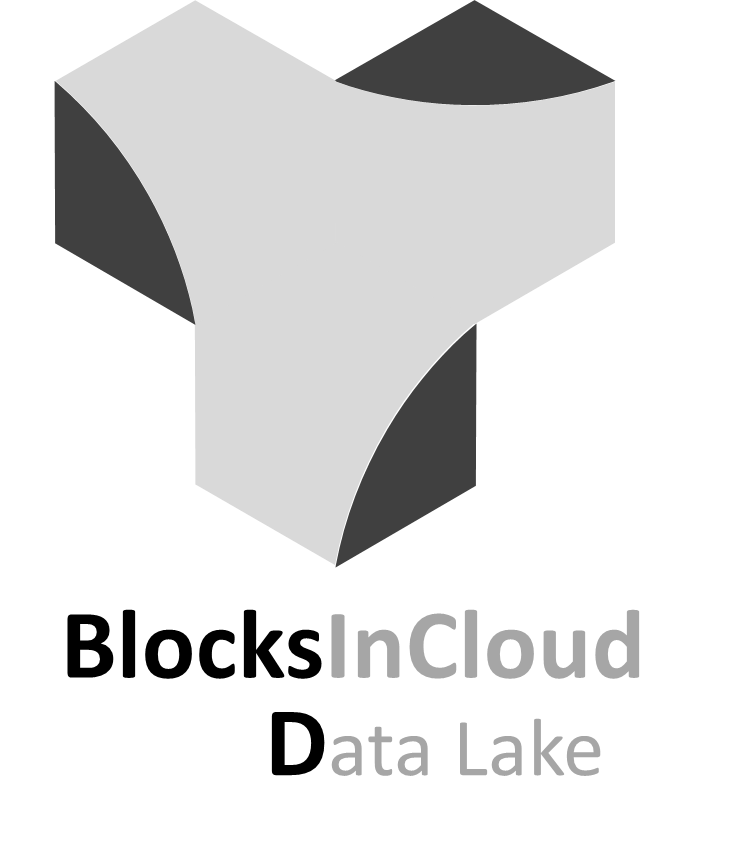
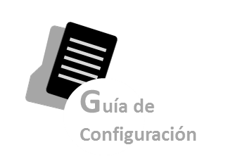

.. BlocksInCloud Data Lake documentation master file, created by
   sphinx-quickstart on Wed Sep  4 18:37:15 2019.
   You can adapt this file completely to your liking, but it should at least
   contain the root `toctree` directive.

=========
Data Lake
=========

.. centered:: |image0|

Revisión: 09-sep-2019 Equipo DataLake

La línea de trabajo DataLake consiste en la creación del repositorio de datos en bruto que alimentan el resto de los sistemas de Telepizza y de donde se nutren tanto el MDM para configurarlos como el resto de las aplicaciones como Store donde se visualizan.

El DataLake debe además cumplir una serie de parámetros técnicos para que dichas aplicaciones puedan alimentarse de la manera correcta y que los datos que lleguen puedan ser entendidos correctamente.

Además, al tratarse de datos confidenciales, el Datalake debe cumplir una serie de premisas de seguridad relevantes de modo que protejan la información que contienen.

Una de las ventajas de un datalake es que puede normalizarse (establecer un patrón) y enriquecerse (combinar información para mayor utilidad). Se puede:

-  Extraer metadatos

-  Convertir formatos

-  Extraer entidades

-  Reticular

-  Agregar

**USUARIOS**

En este apartado se describirán todos los usuarios que van a acceder al sistema.

-  *Responsables de Producto:* Antonio Remesal

-  *Documentalistas:* Departamento de Control de Datos

-  *Responsables del proyecto:* David Expósito y Ana Martinez Used

**ALCANCE**

Este entorno debe recoger toda la información de los productos asociados a BlockInCloud, y aquellos que esta Suite necesita para su funcionamiento. Se incluirán en el mismo todas las versiones de la documentación que estén o puedan estar en uso.

**DOCUMENTACIÓN DE REFERENCIA**

|Guía Técnica|   |Guía Funcional|   |Guía Configuración|   |GTU|    

   

.. toctree::
   :maxdepth: 1
   :hidden:
   :caption: Guía Técnica:
   
   en/technical_documentation/LAKEGT20190830_journey_fomento_uso_app
 
.. toctree::
   :maxdepth: 1
   :hidden:
   :caption: Guía Funcional:
   
   es/guia_funcional/lakegf20190904marketingcloud
   es/guia_funcional/lakegf20190904servicecloud

.. toctree::
   :maxdepth: 1
   :hidden:   
   :caption: Guía de configuración:
   
  
.. toctree::
   :maxdepth: 1
   :hidden:
   :caption: Glosario:
   
   

