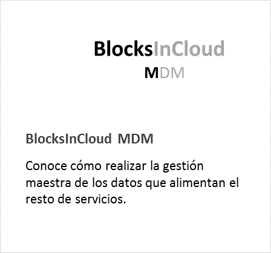

.. BlocksFrontPage documentation master file, created by
   sphinx-quickstart on Mon Jul 29 13:00:49 2019.
   You can adapt this file completely to your liking, but it should at least
   contain the root `toctree` directive.

=============
DOCUMENTATION
=============
	
|espacio_informativo|

|linea_api| |linea_datalake| |linea_academy| 

|MDM| |linea_billing|

   

   